

# Introduction
Controlled Highly Accurate Deadeye, or CHAD, is a robot that plays beer pong.

Before building CHAD, we had two simple goals in mind. 
- Enable a Baxter robot to recognize a red Solo cup and launch a ping pong ball at it.
- As CHAD's accuracy increases, we want it to be able to engage in a turn-based game with multiple cups, against a human adversary.
    
We can break down the game of beer pong into three main problems: 

1. **Computer vision**, to recognize and locate red Solo cups on a table.
2. **Path planning**, to aim Baxter's right arm according to the best trajectory.
3. **Custom end-effector hardware**, to let Baxter "throw" a ping-pong ball with consistency and accuracy.

Our team found this project interesting because of its precise nature. Cups are small targets, and once the ball is in the air, there's nothing more we can do. This means our sensing (vision) must be robust, joint planning exact, and that we needed to be creative with our hardware, since Baxter cannot "throw" a ball like a human can. We also needed to tackle the challenge of projectile motion.

#### Real World Application
Besides helping you win at parties, CHAD has several useful applications in the robotics industry.

Our cup detection could be used in places such as laboratories or warehouses, where precise identification of containers and their orientation can help automate the process of moving objects from one place to another. For example, Amazon is greatly automating their fulfillment centers and relying on robots to do simple moving tasks. 

Our trajectory calculation of the ball makes use of a concept that can be applied to any weapons technology that involves projectiles. For instance, a robot can determine if its current position is the best position to take a shot at a certain target, or if it should move itself to another location that allows for a better trajectory.

# Design

## Criteria
Before any implementation, we decided that we would judge the success of CHAD on these basic criteria:

- Precisely launching the ping pong ball each turn
- Consistent recognition of cups and calculation of trajectory
- Robust end-effector hardware.

The desired functionality for CHAD is to shoot at different configurations and distances of cup targets. At a medium range, and with 6 cups in a diamond formation, we hoped to achieve a 50% cup hit rate.  We believe this percentage represents our team members’ average sober cup pong ability.

## In depth design

### Hardware design:
Our hardware consisted of one toy plastic [ping-pong gun](https://www.amazon.com/Toyvian-Shooting-Child-Random-Color/dp/B07NVCM5VK) (attached to Baxter's right arm gripper), Solo cups, and a table cover. 

Even though we considered other means of launching the ping-pong ball at the target (ranging from rubber band sling shots to air powered cannons) we settled on the ping-pong gun because of how easy it was to modify, repair, or even replace when one inevitably broke. We specifically choose red Solo cups and a black table cover both for the traditional aesthetic and their computer-vision friendly color contrast. Having the distinctive separation between the red exterior, white interior, and dark background allowed us to remove a lot of the noise from the image without having to create more complex vision detection algorithms. 

### Vision
For the vision component, we use an Intel RealSense camera and image processing to identify cups within the frame. Then for each cup we compute a center coordinate, corresponding to the center point of the circle created by the rim of each cup. We then return the coordinates of this point (in the camera frame) to the targeting component.

### Targeting
We place an AR-tag next to the cups on the table, not to provide a target, but rather to sync the coordinate frames of our RealSense camera and Baxter's camera. This effectively translates our target point from the RealSense camera frame to Baxter's frame. Now CHAD knows where to aim.
    
### Trajectory calculation: 
Upon receiving the coordinates of the cup in Baxter's frame, we first determine the required Yaw Angle Psi (ψ). 

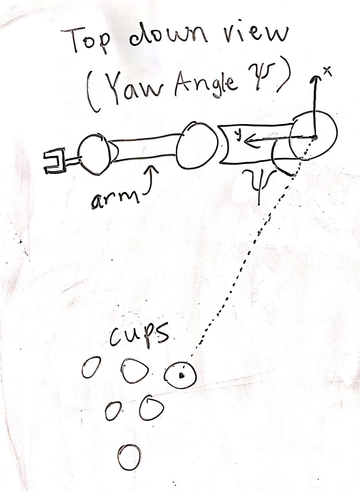

We can find ψ using a cosine relationship.  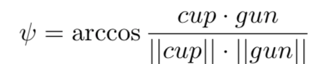

"cup" is the vector from the base to the target, projected on the xy-plane. "gun" is the vector from the base to the gun's current position, projected onto the xy-plane.

After CHAD's shoulder is rotated by ψ, we calculate the Pitch Angle (θ) for the wrist. We use the projectile motion equation: 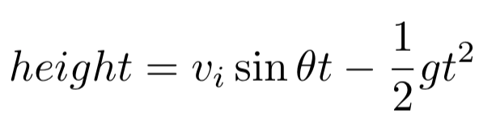

Given the initial velocity of the ball in the z direction v_iz, distance to target ∆d, and height to target ∆z, we can find the pitch angle θ.

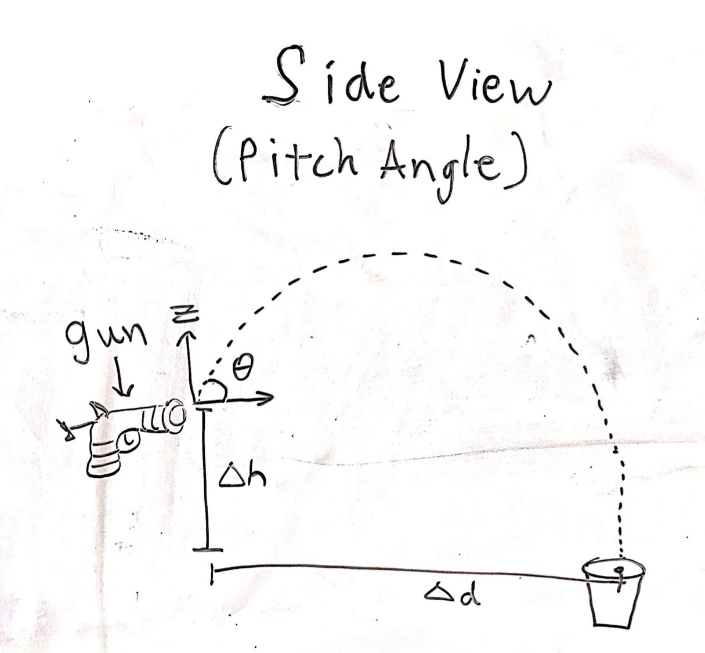

Solving this quadratic equation gives us the pitch angle θ. 
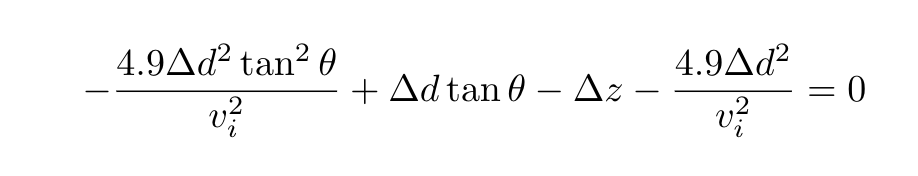

The derivation can be found here:

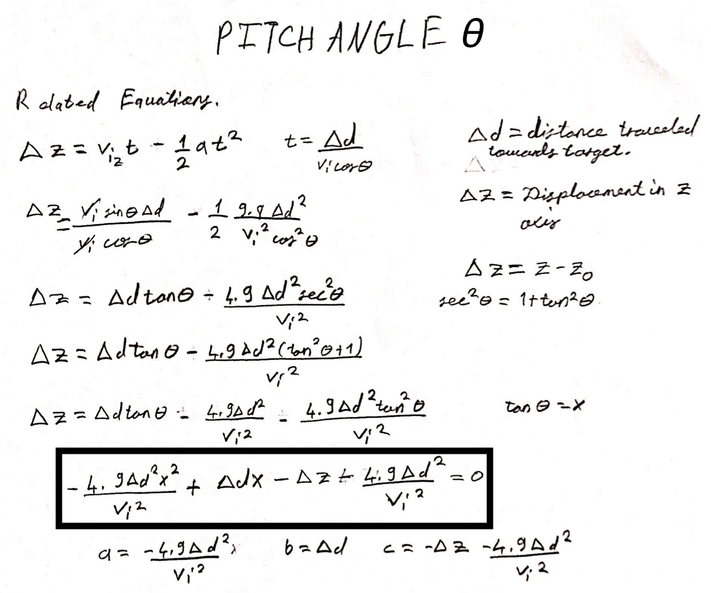

Finally, CHAD can launch the ping-pong ball by squeezing the trigger on the ping-pong gun.

## Design choices and trade-offs
Our main trade-off was our end-effector, which was used to achieve the throwing action of the ball by the robot. Using a plastic gun helped us achieve initialization of the force acting on the ball. Otherwise, it was very difficult to give initial velocity to the ball by mimicking human throwing action based on the torque that is achieved by the arm movements. However, the gun was not very stable and consistency of the velocity generated by the gun is questionable.
	
For the vision, we decided to use an Intel RealSense camera. In order to focus on the target, we cropped the image that is received from the camera. This is because we wanted to reduce noise and computation time. This design choice helped us focus on the target while reducing the number of pixels the code had to process.        
    

For the targeting, the design choice we made is to set an initial position of the robot arms with the gun at a fixed distance away from the shoulder. We wanted to aim at the target both using a pitch angle to control how far the ball travels as well as a yaw angle to set the direction of travel. For the yaw angle we aligned the end-effector with the robot's shoulder so that changing the angle at shoulder joint would linearly control the yaw angle. We tried to control the pitch with the second wrist angle; however, because the gun was always attached at an offset relative to the wrist's axis of rotation, we had to compromise by adding an offset to the pitch angle θ.

### Effects of our design choices
- Robustness: The vision component works efficiently for a fixed configuration, as it has parameters (e.g. cropping) which are specific to the cup configuration. However, once that is set, from our experiments, we have seen that it identifies cups and the targeting points effectively and efficiently.
- Durability: Using a plastic toy gun seemed unreliable at first, so we needed to conduct extensive test shots with the gun in order to determine how precise it is, and also calculate an initial velocity of the ping pong ball.
- Efficiency: Our design is both time and cost efficient. Our decision of using a publisher-subscriber model ensures that CHAD is always listening for target coordinates, which are transferred from the cup detection node to the baxter gripper and arm actuation nodes. CHAD's path planning improves efficiency by only ever moving two joints, the shoulder and the wrist, to aim the arm to a selected cup. The only purchases required were a set of plastic ping pong guns and ping pong balls ($10 on amazon) and red Solo cups, which we already had. Other materials (zip ties, rubber bands, tape, etc.) were negligible.

In terms of robustness and durability of the project, we were limited to Baxter's capabilities. One problem we are facing is the oscillation of the arm. Thus, there is a period of time that we need to wait so that it stabilizes. The end effector we added is robust and durable with the help off the zip ties and the rubber bands attached to the plastic gun. The recoil of the gun does not affect our targeting.
    
Moreover, in terms of efficiency, the process we created to set the offset angle for the pitch makes was very inefficient. However, the design can be improved by enhancing CHAD's vision so that robot can optimize the angle by the feedback from how far the ball goes. But looking at what we did for vision, how we detect the target is very efficient because of our decision to crop the image to get rid of the unnecessary noise and lower computation time but limits our view to fit only about 6 cups.

# Implementation

## Hardware & Parts
We ordered a plastic gun from Amazon to be our ping pong ball actuator. However, we still needed to do two things for it to work: 1. Determine how to attach the gun to Baxter. 2. Conduct tests to calculate the average initial velocity of the ball when shot out of our gun. We used zip ties and rubber bands to properly secure the gun. Our test results are available at the bottom of this page. 

 

We also set up red Solo cups on a black tablecloth for the targets.

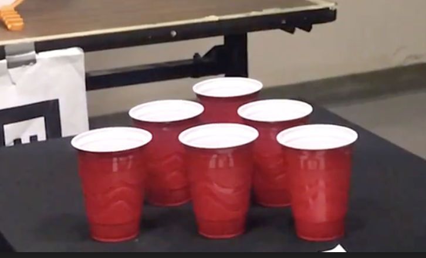

## Software
### Vision Component
For the vision component, we cropped the image generated by the RealSense camera. We determined the range to crop by arbitrarily setting width and height bounds and tilting our camera such that the cups do not get cropped out. Thereafter, we used a mask to filter out only the colors red and white (as these are the colors of the cup). Next, we used erosion and dilation to remove any noise and to help make the detected rims more circular in shape. Following, we founds the contours of the image by using Canny edge detection, then calling OpenCV's contour function. This provided us with the figures of all the cups. From there, we take only the circular contours, as these will be the cup rims, and for each circular contour we calculate its moment and draw it on the image as a circle. Since the targeting component simply needed one point, we generate just one moment and return a binary image containing only said moment. Then, we use lab6 point cloud projection code to create a point cloud, which is just one point (the moment) and we attach a TF Frame centered at said point. An example of this processing can be seen below, for an image with 1 cup.

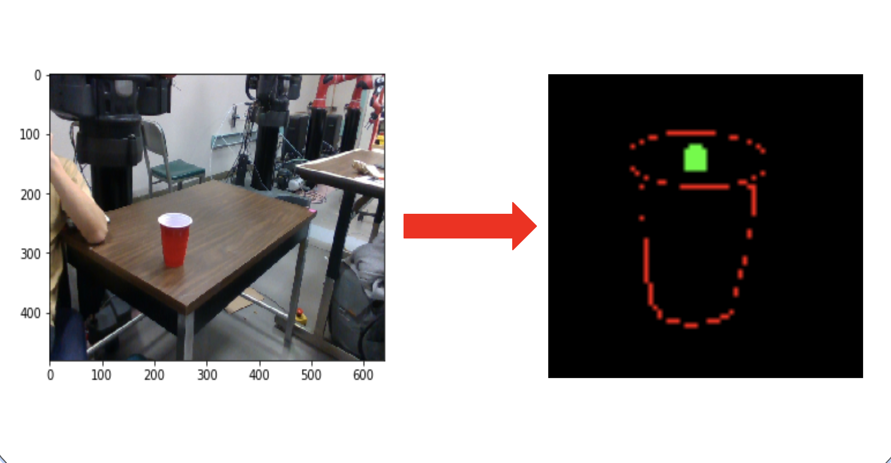

### Shooting the ball once

The very first part of the system is a set setup operations to calibrate the gripper's maximum and minimum position (to prevent crushing the gun) and aligning the gun to a predefined default set of angles for each joint.
    
We have an Intel RealSense camera which is recording and sending frames to the vision component. These frames are processed, as outlined above, and a cup coordinate, in the coordinate basis of the camera, is found and sent as the origin of a new TF Frame. 
    
Simultaneously, we used the ROS package "ar\_track\_alvar" to identify the orientation and location of an AR tag that was visible both to the RealSense and the Baxter cameras. Using this common point between the Baxter and the camera, we were able to define the tf frame of the cup center relative to the AR tag and send it over a python socket from the lab computer to the ROS instance running on Baxter.
    
Then we calculate the two launch angles ψ and θ according to the trajectory algorithms described above in the design portion. Baxter uses the MoveIt planner and controller from lab 7 to set its shoulder and wrist joint to ψ and θ, respectively.
    
With the gun in place, a subscriber controlling and tracking the status of the gripper claw is notified to close in order to actuate gun then open on completion of the launch. once the ping pong is shot, we return the arm to the default position to make sure we never block the line of sight for Baxter camera with the shooting arm.
    

# Results
Our project worked well. In our proposal, we aimed for CHAD's accuracy to be greater than 50%, through all of our tests we averaged about 65% accuracy. The main action we expected to perform was to able to show the target on the Baxter whenever we started the code and also make a shot which goes inside the red Solo cup. We have achieved these two tasks during our demo.

The video below shows CHAD hitting 5 cups out of 6 shots, an 83% hit rate.

## Video

<a href="https://youtu.be/vgKuwmRlPrg" target="_blank">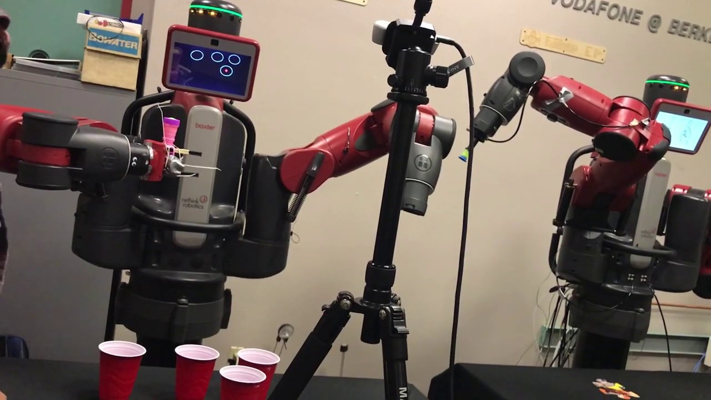</a>

# Conclusion
## Discussion of Results
On average, our accuracy meets our base goal of 50%. Unfortunately, we were never able to have it successfully shoot all 6 cups in one continuous session due to various errors, e.g. MoveIt planner failing, tracking of AR tag being lost midway, RealSense connection loss, etc. However, we have videos, linked in the Additional Materials section, of it being able to target and shoot most of the 6 cups, individually. Thus, we have confidence that outside of said errors, CHAD could maintain our desired accuracy over all 6 cups, continuously.

## Difficulties
The noise due to the computer vision created some difficulties for finding the target. We were also unable to better tune the PID controller for the baxter, so each motion involved oscillations that we had to manually wait for. Other issues is that the pitch angle calculations do not account for the offset between the wrist axis of rotation and the the gun's tip. The last difficulty we faced was that both fingers moved to close the gripper, mounting the gun rigidly to only one finger without jamming the other resulted in a substantial amount of duct tape and zip ties.

## Flaws & Hacks

One hack in our solution is the cropping of the frames within the vision component. While this simplified our image processing, since we only had at most 6 cups, it is not immediately generalizable to games with a large number of cups. Currently, to accommodate a greater number of cups we would have to change the cropping dimension, but a clearer, less-hacky solution is definitely possible. Specifically, we could experiment with the use of more noise reduction methods such as erosion and dilation, e.g. using larger kernels than that of which we currently use, image blurring, etc. Also we use a specific mask on the images, one that only saves pixels which are red or white, as we had a fixed color of the cups. We could experiment with avoiding this step and directly detecting the cups based on the contours and their relative area in the picture. This would allow the system to generalize to different types and colors of cups.
    
Moreover, we had a goal of CHAD engaging in gameplay against an adversary. While we can still accomplish this through manual execution of the launch files, we were imagining having a GUI for such gameplay and using our drunk noise function which would add noise to the vision component for each point scored by the opponent. Unfortunately, due to our struggles testing CHAD when he was sober, we were unable to test such additional functionality. Ideally, we would test the drunk noise function and implement a GUI to fix this weakness. 
    
Lastly, for the difficulty regarding the offset axis of rotation, While adding an offset worked, it was more of a work around. A more robust solution would have required adjusting multiple arm angles such that the orientation of the gun's tip changed to the appropriate pitch angle while the overall position of the ping pong ball remained unchanged, allowing the gun to "turn on a dime." However, since reliably attaching the gun to Baxter in a consistent manner with human hands is impossible, adding a computer vision element to track the ping pong ball's landing and path would ensure robustness. Given more time, implementing such an addition would allow Baxter to correct itself and even account for other launch methods (so long as they have a consistent initial velocity).

# Team
## Meet the Team

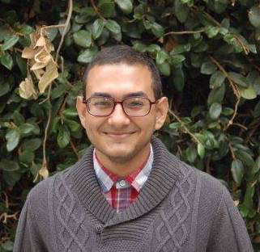 

Mina Beshay: Mina is a mechanical engineer and has machine shop experience as well as a strong design background. He created the methods for sending filtered image and cup position data to baxter as well as the overall control loop actuating baxter's joints to the appropriate angles.

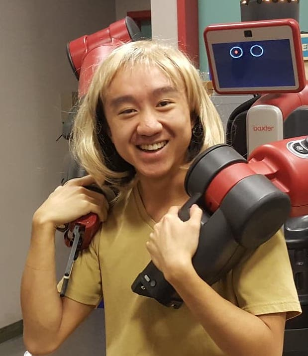

George Wang: George is a CS major. He likes beer and Baxters. He knows python and a bit of ROS. George wrote code for the gripper calibration and CHAD's trigger pull. He wrote most of this website and made the diagrams/visuals on this page.

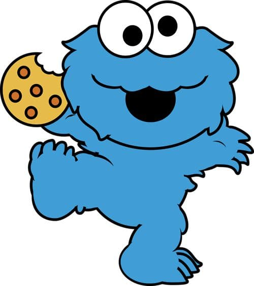

Akash Gokul: Akash's background is in computer science and machine learning. He does research in computer vision. Akash was in charge of the vision component. He wrote most of the code for the vision component of the project.

Artun Dalyan: Artun has a background in signal processing as well as feedback systems. Artun helped Akash with vision for detecting target. Also, he worked on the targeting component and derived equations of physics which were coded for CHAD.

# Additional Materials
## Additional Videos:
[Target Practice](https://www.youtube.com/playlist?list=PLZ-IT-baKuPN3qfjerJrOVII1s8dunu5x)

### Initial velocity calculations of toy gun

[Gun Videos.](https://youtu.be/7xTkK3VTanw) Method used: same projectile motion equation as mentioned above. Keeping the pitch angle at 0 degrees, we measure height and distance traveled.

Results: (we used the average of 12 test shots to come up with an initial velocity of 3.27 m/s)

## Code
Code for our project can be found [here](https://github.com/chad-bot/CHADBot) (github.com/chad-bot/CHADBot).

Code for this [website.](https://github.com/chad-bot/Beer-Pong)
 
## Happy Holidays!
Love, CHAD. *December 2019*

